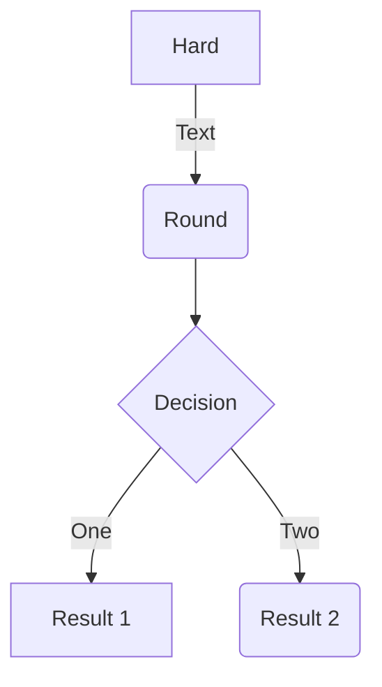
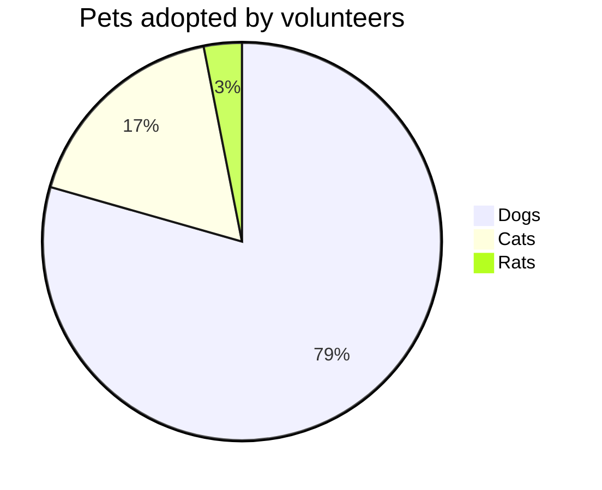

这里是文章摘要...

<!-- more -->

mermaid 流程图 + 饼图使用[^1]

## 流程图

## 饼图

> https://mermaid-js.github.io/mermaid/#/pie

## 参考

[^1]: [mermaid](https://github.com/mermaid-js/mermaid/blob/develop/README.zh-CN.md)
